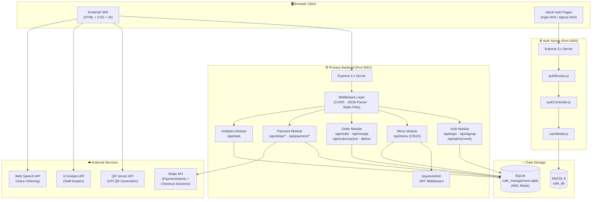
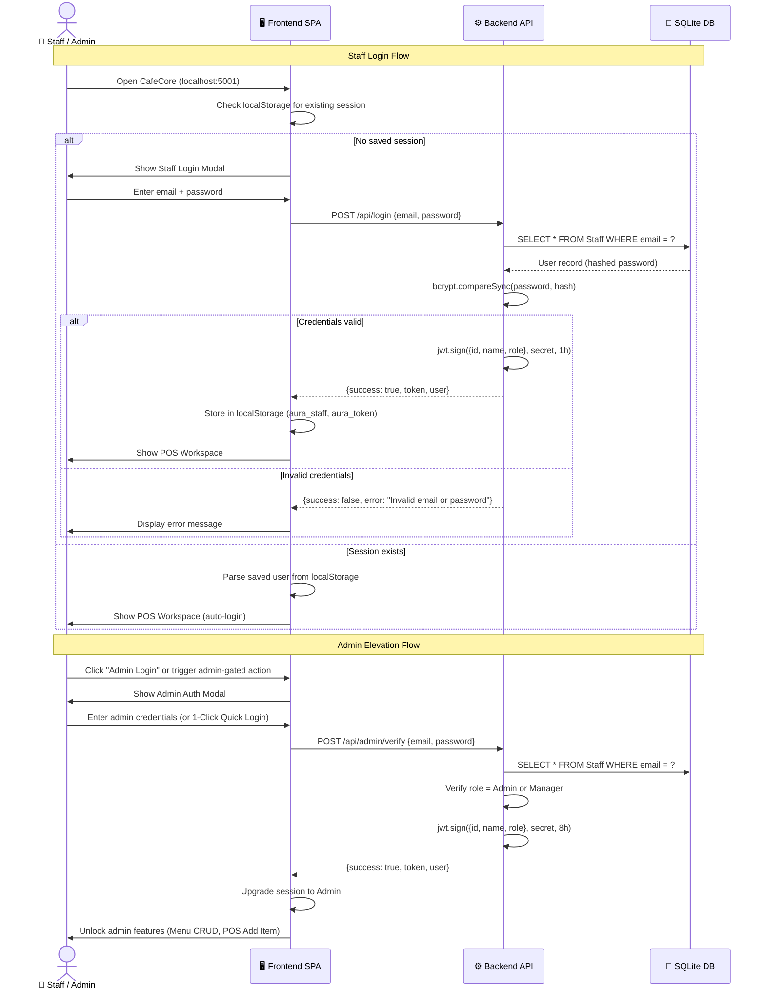
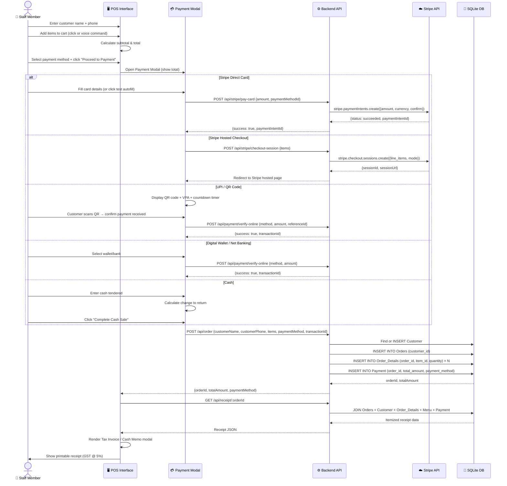
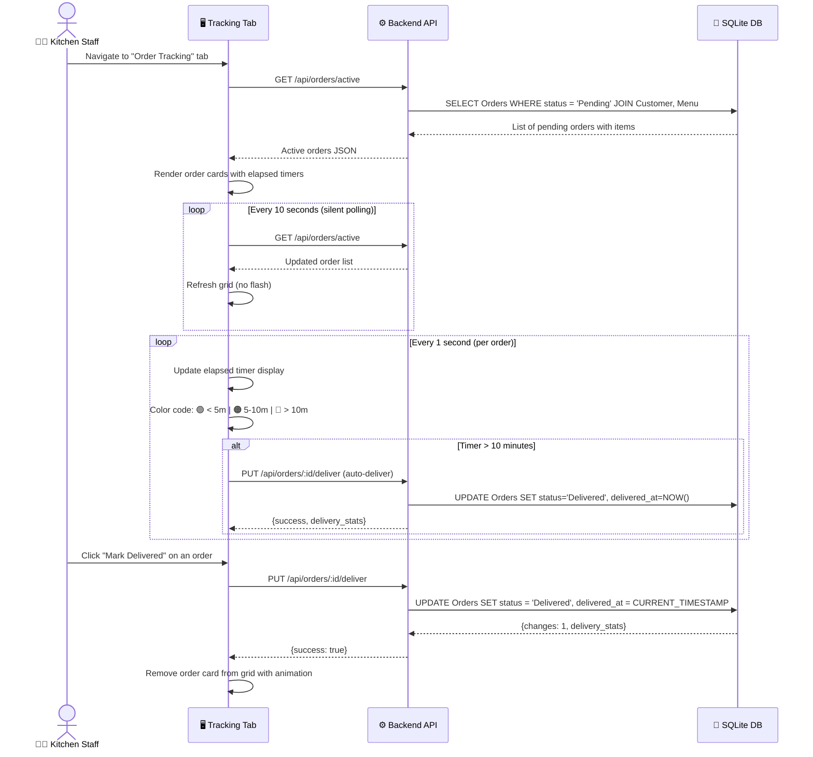
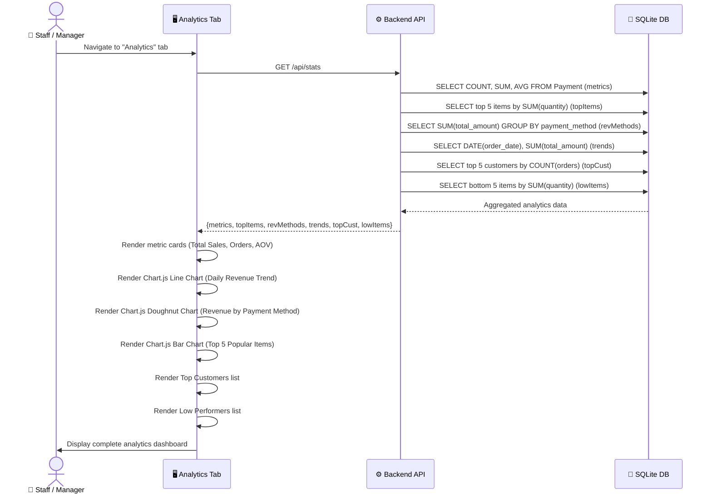

<div align="center">

# ☕ CafeCore

### Full-Stack Cafe Point-of-Sale & Management System

**A production-grade POS system built for Aura Cafe — handles orders, multi-gateway payments, staff authentication, real-time kitchen tracking, menu management, and business analytics from a single browser interface.**

[](https://nodejs.org/)
[](https://expressjs.com/)
[](https://www.sqlite.org/)
[](https://stripe.com/)
[](https://www.chartjs.org/)
[]()

</div>

---

## 📑 Table of Contents

- [About the Project](#-about-the-project)
- [System Architecture](#-system-architecture)
  - [High-Level Architecture Diagram](#high-level-architecture-diagram)
  - [Architectural Layers & Responsibilities](#architectural-layers--responsibilities)
- [Key Modules & Capabilities](#-key-modules--capabilities)
- [Working Flow](#-working-flow)
  - [User Authentication Flow](#1-user-authentication-flow)
  - [Order & Payment Processing Flow](#2-order--payment-processing-flow)
  - [Order Tracking / Kitchen Display Flow](#3-order-tracking--kitchen-display-flow)
  - [Analytics Dashboard Flow](#4-analytics-dashboard-flow)
- [Database Design](#-database-design)
  - [Entity-Relationship Diagram](#entity-relationship-diagram)
  - [Table Schemas](#table-schemas)
- [Tech Stack](#-tech-stack)
- [Prerequisites](#-prerequisites)
- [Setup Instructions](#-setup-instructions)
- [Default Credentials](#-default-credentials)
- [API Endpoints](#-api-endpoints)
- [Environment Variables](#-environment-variables)
- [Folder Structure](#-folder-structure)
- [Screenshots / Demo](#-screenshots--demo)
- [Known Issues / Limitations](#-known-issues--limitations)
- [Future Improvements](#-future-improvements)
- [Contributing](#-contributing)
- [License](#-license)
- [Author](#-author)

---

## 📖 About the Project

CafeCore is a monorepo containing **two independent server applications** and **two frontend layers** that together deliver a complete cafe management experience:

| Component | Description | Port |
|-----------|-------------|------|
| **`backend/`** | Primary Express server backed by **SQLite** (`better-sqlite3` in WAL mode). Serves the full SPA and exposes all business-logic APIs — orders, multi-gateway payments (Stripe, UPI, Wallets, Cash), menu CRUD, analytics, and role-based auth. | `5001` |
| **`server/`** | Secondary Express server backed by **MySQL** (`mysql2/promise`). Implements a clean **MVC pattern** (routes → controllers → models) for a standalone staff signup/login flow. | `5000` |
| **`frontend/`** | Vanilla JS single-page application served by `backend/`. Full POS interface, kitchen order tracker, admin menu manager, and analytics dashboard — **1,665 lines** of client-side logic. | — |
| **`client/`** | Lightweight HTML login/signup pages served by `server/` for the MySQL auth flow. | — |

---

## 🏗 System Architecture

### High-Level Architecture Diagram



### Architectural Layers & Responsibilities

The system follows a **layered architecture** with clear separation of concerns across four primary layers:

```mermaid
graph LR
    subgraph PRESENTATION["1️⃣ Presentation Layer"]
        direction TB
        P1["SPA Shell (index.html)"]
        P2["CSS Design System (style.css)"]
        P3["Client-Side Logic (script.js)"]
        P4["Chart.js Visualizations"]
        P5["Legacy Auth Pages (client/)"]
    end

    subgraph APPLICATION["2️⃣ Application / API Layer"]
        direction TB
        A1["Express REST API Router"]
        A2["JWT Auth Middleware"]
        A3["RBAC (requireAdmin)"]
        A4["Request Validation"]
        A5["Stripe SDK Integration"]
    end

    subgraph BUSINESS["3️⃣ Business Logic Layer"]
        direction TB
        B1["Order Processing"]
        B2["Payment Gateway Orchestration"]
        B3["Receipt / Invoice Generation"]
        B4["Analytics Aggregation (SQL)"]
        B5["Password Hashing (bcrypt)"]
    end

    subgraph DATA["4️⃣ Data Access Layer"]
        direction TB
        D1["better-sqlite3 (WAL)"]
        D2["mysql2/promise Pool"]
        D3["Schema Auto-Creation"]
        D4["Auto-Seeding Logic"]
    end

    PRESENTATION --> APPLICATION --> BUSINESS --> DATA
```



| Layer | Responsibility | Key Files |
|-------|---------------|-----------|
| **1. Presentation** | Renders the UI. Manages DOM manipulation, client-side routing (tab navigation), form validation, voice recognition, chart rendering, and all user interactions. Communicates with the API layer via `fetch()`. | `frontend/index.html`, `frontend/script.js`, `frontend/style.css`, `client/*.html` |
| **2. Application / API** | Defines RESTful HTTP endpoints. Handles request parsing, CORS, JWT extraction, role-based route protection (`requireAdmin` middleware), and response formatting. Routes incoming HTTP requests to business-logic handlers. | `backend/server.js` (routes + middleware), `server/routes/authRoutes.js` |
| **3. Business Logic** | Implements core domain rules — customer lookup/creation, order creation with line items, payment recording with transaction IDs, analytics SQL aggregation (top items, revenue by method, daily trends), password hashing (bcrypt 10 rounds), and JWT signing/verification. | `backend/server.js` (handler functions), `server/controllers/authController.js` |
| **4. Data Access** | Manages database connections, schema creation (auto-`CREATE TABLE IF NOT EXISTS`), seed data insertion, and all SQL queries. Provides `initDB()` / `getDB()` for SQLite and `initializeDB()` / `getPool()` for MySQL. | `backend/db.js`, `server/config/db.js`, `server/models/userModel.js` |

---

## 🧩 Key Modules & Capabilities

### 1. Authentication & Authorization Module

| Capability | Details |
|-----------|---------|
| **Staff Signup** | Email/password registration with bcrypt hashing (10 salt rounds). Duplicate email detection. |
| **Staff Login** | Validates credentials and returns a signed JWT (1-hour expiry). |
| **Admin Verification** | Separate re-authentication endpoint for elevated access. Admin/Manager tokens expire in 8 hours. |
| **Role-Based Access Control** | Four roles: `Admin`, `Manager`, `Barista`, `Cashier`. Menu write operations (add/edit/delete) are gated behind `requireAdmin` JWT middleware. |
| **Session Management** | JWT + user data stored in `localStorage`. UI dynamically adapts to the logged-in role (badges, button states, banners). |
| **Dual Auth Portals** | Staff Login modal and Admin Login Portal with seamless switching. 1-Click quick demo login for admin. |

### 2. Point-of-Sale (POS) Module

| Capability | Details |
|-----------|---------|
| **Dynamic Menu Grid** | Renders menu items from API with food photo thumbnails and category icons. |
| **Real-Time Search** | Instant menu filtering by item name as staff types. |
| **Cart Management** | Add/remove items, adjust quantities, live subtotal and total calculation. |
| **Customer Input Validation** | Phone: strictly 10 digits (numeric only). Name: letters and spaces only. Shake animation on validation error. |
| **Voice Ordering** | Web Speech API integration — say "add 2 latte" or "checkout". Speech synthesis confirms the action. |
| **Quick Add Item** | Admin can add new menu items directly from the POS view (gated behind admin auth). |

### 3. Payment Gateway Module (5 Methods)

| Method | Implementation |
|--------|---------------|
| **💳 Stripe Direct Card** | Creates a `PaymentIntent` via `/api/stripe/pay-card`. In-app card form with test autofill (Visa 4242, MC 5555, Amex 0005). |
| **💳 Stripe Hosted Checkout** | Creates a `Checkout Session` via `/api/stripe/checkout-session`. Redirects to Stripe's hosted page. Handles `?payment_success` and `?payment_cancelled` callbacks. |
| **📱 UPI / QR Code** | Generates a UPI deep-link QR code via `api.qrserver.com`. Displays VPA with copy-to-clipboard. 5-minute countdown timer. Optional UTR reference entry. |
| **👛 Digital Wallet / Net Banking** | Radio selection: Paytm, PhonePe, Amazon Pay, MobiKwik, HDFC, ICICI, SBI, Axis. Verified via `/api/payment/verify-online`. |
| **💵 Cash** | Enter cash tendered; quick-select chip buttons (₹100–₹2000). Calculates and displays exact change. |

### 4. Order Management Module

| Capability | Details |
|-----------|---------|
| **Atomic Order Creation** | Single API call creates/finds Customer → creates Order → inserts Order_Details → creates Payment record. |
| **Tax Invoice / Receipt** | Generates a printable receipt with itemized breakdown, GST at 5%, order ID, customer info, and payment method. |
| **Print Support** | Browser print dialog for thermal-printer-style output. |

### 5. Order Tracking / Kitchen Display Module

| Capability | Details |
|-----------|---------|
| **Live Queue** | Displays all `Pending` orders with customer name and line-item list. |
| **Elapsed Timer** | Per-order timer updates every second. Color-coded: 🟢 < 5 min, 🟠 5–10 min, 🔴 > 10 min. |
| **Auto-Deliver** | Orders open > 10 minutes are automatically marked as delivered. |
| **Silent Polling** | Background refresh every 10 seconds without visible UI flash. |
| **Manual Deliver** | One-click "Mark Delivered" button records `delivered_at` timestamp. |

### 6. Analytics Dashboard Module

| Capability | Details |
|-----------|---------|
| **KPI Metrics** | Total Sales (₹), Total Orders, Average Order Value — in metric cards. |
| **Daily Sales Trend** | Chart.js line chart of daily revenue over time. |
| **Revenue by Payment Method** | Chart.js doughnut chart — Stripe, UPI, Wallet, Cash breakdown. |
| **Top 5 Popular Items** | Chart.js horizontal bar chart — most-sold items by units. |
| **Top Repeat Customers** | Ranked list of customers with highest order counts. |
| **Low Performers** | Items with the fewest units sold — helps optimize the menu. |

### 7. Menu Management Module (Admin Only)

| Capability | Details |
|-----------|---------|
| **CRUD Operations** | Add new items, edit name/price, delete items — all gated behind admin JWT. |
| **Admin Status Banner** | Visual indicator showing whether admin privileges are active or locked. |
| **Instant Sync** | Changes propagate immediately to both the management table and the live POS grid. |
| **Search** | Filter menu items within the management table. |

---

## 🔄 Working Flow

### 1. User Authentication Flow



### 2. Order & Payment Processing Flow



### 3. Order Tracking / Kitchen Display Flow



### 4. Analytics Dashboard Flow



---

## 🗄 Database Design

### Entity-Relationship Diagram

```mermaid
erDiagram
    STAFF {
        INT staff_id PK
        TEXT name
        TEXT email UK
        TEXT password
        TEXT role
    }

    CUSTOMER {
        INT customer_id PK
        TEXT name
        TEXT phone UK
    }

    MENU {
        INT item_id PK
        TEXT item_name UK
        REAL price
    }

    ORDERS {
        INT order_id PK
        INT customer_id FK
        DATETIME order_date
        TEXT status
        DATETIME delivered_at
    }

    ORDER_DETAILS {
        INT order_detail_id PK
        INT order_id FK
        INT item_id FK
        INT quantity
    }

    PAYMENT {
        INT payment_id PK
        INT order_id FK_UK
        REAL total_amount
        TEXT payment_method
    }

    CUSTOMER ||--o{ ORDERS : "places"
    ORDERS ||--o{ ORDER_DETAILS : "contains"
    MENU ||--o{ ORDER_DETAILS : "referenced in"
    ORDERS ||--|| PAYMENT : "paid via"
```

### Table Schemas

| Table | Purpose | Key Constraints |
|-------|---------|----------------|
| **Staff** | Store staff accounts (Admin, Manager, Barista, Cashier) | `email` UNIQUE, `password` bcrypt-hashed |
| **Customer** | Store customer profiles | `phone` UNIQUE (10-digit) |
| **Menu** | Store cafe menu items | `item_name` UNIQUE, `price` > 0 |
| **Orders** | Track individual orders with status | FK → Customer, `status` defaults to `'Pending'` |
| **Order_Details** | Line items linking orders to menu items | FK → Orders, FK → Menu, `quantity > 0` CHECK |
| **Payment** | One-to-one payment record per order | FK → Orders (UNIQUE), stores `payment_method` with transaction ID |

### Relationships

- **Customer → Orders**: One-to-Many (a customer can place many orders)
- **Orders → Order_Details**: One-to-Many (an order can have many line items)
- **Menu → Order_Details**: One-to-Many (a menu item can appear in many orders)
- **Orders → Payment**: One-to-One (each order has exactly one payment record)

---

## 🛠 Tech Stack

### Frontend

| Technology | Purpose |
|-----------|---------|
| HTML5 | SPA shell (`frontend/index.html`) and legacy auth pages (`client/`) |
| CSS3 (Vanilla) | Dark-theme design system with glassmorphism and micro-animations |
| JavaScript (ES6+) | All SPA logic — 1,665 lines in `frontend/script.js` |
| Chart.js (CDN) | Line, Doughnut, and Bar charts in the Analytics tab |
| Font Awesome 6.4 (CDN) | All icons throughout the UI |
| Google Fonts (Outfit) | Primary typography |
| Web Speech API | Voice ordering (`webkitSpeechRecognition`) and spoken feedback (`SpeechSynthesisUtterance`) |
| UI Avatars API | Generates dynamic staff avatar images from their name |
| QR Server API | Generates live UPI payment QR codes |

### Backend

| Technology | Purpose |
|-----------|---------|
| Node.js 18+ | Runtime for both `backend/` and `server/` |
| Express 4.x / 5.x | HTTP server and REST API routing |
| bcryptjs | Password hashing (10 salt rounds) |
| jsonwebtoken (JWT) | Token signing and verification |
| cors | Cross-origin request handling |
| dotenv | Environment variable loading |
| Stripe SDK v22 | PaymentIntent creation and Hosted Checkout Sessions |

### Database

| Technology | Purpose |
|-----------|---------|
| SQLite via `better-sqlite3` | Primary database for `backend/` — WAL mode, auto-seeded |
| MySQL 8 via `mysql2/promise` | Secondary database for `server/` — connection pool, auto-initialized |

### Dev Tools

| Technology | Purpose |
|-----------|---------|
| nodemon | Auto-reload for `backend/` in development mode |
| serve | Static file server for `frontend/` standalone development |

---

## 📋 Prerequisites

Before starting, make sure the following are installed:

- **Node.js v18 or higher** — [Download](https://nodejs.org/)
- **npm v9 or higher** — bundled with Node.js
- **MySQL 8.x** — only required if you want to run the `server/` auth module; **not needed for the main app**
- **Git** — [Download](https://git-scm.com/)
- A **Stripe account** with a test secret key — only required if you want to enable Stripe payments (optional)

To verify your environment:

```bash
node --version   # Should be v18+
npm --version    # Should be v9+
mysql --version  # Only if running server/ module
```

---

## 🚀 Setup Instructions

### 1. Clone the Repository

```bash
git clone https://github.com/bhupendrayv/CafeCore.git
cd CafeCore
```

### 2. Set Up the Main App — `backend/` (SQLite, No Database Install Required)

#### Install Dependencies

```bash
cd backend
npm install
```

#### Configure Environment Variables

Create a `.env` file inside the `backend/` folder (it is already `.gitignore`d):

```env
# backend/.env
PORT=5001
JWT_SECRET=replace_with_a_long_random_secret_string
STRIPE_SECRET_KEY=sk_test_your_stripe_key_here
```

> `STRIPE_SECRET_KEY` is **optional**. If omitted, all Stripe payment options are automatically disabled and the app will still function with UPI, Wallet, and Cash payments.

#### Run in Development Mode (with auto-reload)

```bash
npm run dev
```

#### Run in Production Mode

```bash
npm start
```

#### Open in Browser

```
http://localhost:5001
```

> The SQLite database file `backend/cafe_management.sqlite` is **created automatically** on first run. Default seeded accounts are listed below.

---

### 3. Set Up the Legacy Auth Module — `server/` (MySQL Required)

This module is a standalone MVC auth service that serves the `client/` HTML pages. It is **independent** of the main `backend/` server.

#### Prerequisites

Ensure MySQL 8 is running locally.

#### Install Dependencies

```bash
cd server
npm install
```

#### Configure Environment Variables

Create a `.env` file inside the `server/` folder:

```env
# server/.env
PORT=5000
DB_HOST=localhost
DB_USER=root
DB_PASSWORD=your_mysql_root_password
DB_NAME=cafe_db
JWT_SECRET=replace_with_a_long_random_secret_string
```

#### Run the Server

```bash
node server.js
```

> The `cafe_db` MySQL database and `users` table are created automatically on first run.

#### Open in Browser

```
http://localhost:5000/signup
```

### 4. Running Both Servers Together

Open two separate terminal windows:

```bash
# Terminal 1 — Main backend (SQLite, port 5001)
cd backend
npm start

# Terminal 2 — Auth module (MySQL, port 5000)
cd server
node server.js
```

---

## 🔑 Default Credentials

These accounts are auto-seeded into SQLite the first time `backend/` starts:

| Name | Email | Password | Role |
|------|-------|----------|------|
| Admin Master | `admin@aura.cafe` | `admin123` | Admin |
| Alice Manager | `alice@aura.cafe` | `password123` | Manager |
| Bob Barista | `bob@aura.cafe` | `password123` | Barista |

> ⚠️ **Warning:** Change these credentials before deploying to any public-facing environment.

### Utility Scripts (Optional)

Located in `backend/`, these can be run manually:

```bash
# Add new menu items to an existing SQLite database
node update.js

# Reset all menu item prices to their original values
node update_prices.js
```

---

## 🔌 API Endpoints

All endpoints are served by `backend/server.js` on port `5001`. Base URL: `http://localhost:5001/api`

### Authentication

| Method | Route | Auth | Description |
|--------|-------|------|-------------|
| `POST` | `/api/signup` | None | Register a new staff account |
| `POST` | `/api/login` | None | Staff login — returns a signed JWT |
| `POST` | `/api/admin/verify` | None | Re-authenticate as Admin or Manager — returns an elevated JWT |

### Menu

| Method | Route | Auth | Description |
|--------|-------|------|-------------|
| `GET` | `/api/menu` | None | Fetch all menu items |
| `POST` | `/api/menu` | Admin / Manager JWT | Add a new menu item |
| `PUT` | `/api/menu/:id` | Admin / Manager JWT | Update item name and price |
| `DELETE` | `/api/menu/:id` | Admin / Manager JWT | Delete a menu item |

### Orders

| Method | Route | Auth | Description |
|--------|-------|------|-------------|
| `POST` | `/api/order` | None | Place an order (creates Customer, Order, Order_Details, Payment records) |
| `GET` | `/api/receipt/:orderId` | None | Fetch a full itemized receipt for an order |
| `GET` | `/api/orders/active` | None | List all orders with status `Pending` |
| `PUT` | `/api/orders/:id/deliver` | None | Mark an order as `Delivered`; records `delivered_at` timestamp |

### Analytics

| Method | Route | Auth | Description |
|--------|-------|------|-------------|
| `GET` | `/api/stats` | None | Returns total sales, orders, AOV, top items, revenue by method, daily trends, top customers, low performers |

### Payments

| Method | Route | Auth | Description |
|--------|-------|------|-------------|
| `GET` | `/api/payment/config` | None | Returns available payment methods and Stripe enablement status |
| `POST` | `/api/stripe/checkout-session` | None | Creates a Stripe Hosted Checkout Session; returns `sessionUrl` |
| `POST` | `/api/stripe/pay-card` | None | Creates and confirms a Stripe PaymentIntent directly |
| `POST` | `/api/payment/verify-online` | None | Verifies a UPI, Wallet, or Net Banking reference; returns a transaction ID |

---

> The `server/` module (port `5000`) also exposes:

| Method | Route | Description |
|--------|-------|-------------|
| `POST` | `/api/signup` | MySQL-backed staff registration |
| `POST` | `/api/login` | MySQL-backed staff login |

---

## ⚙️ Environment Variables

### `backend/.env`

| Variable | Description | Required |
|----------|-------------|----------|
| `PORT` | Port the backend server listens on (default: `5001`) | No |
| `JWT_SECRET` | Secret key used to sign and verify JWTs | **Yes** |
| `STRIPE_SECRET_KEY` | Stripe secret key — starts with `sk_test_` or `sk_live_` | No |

> If `STRIPE_SECRET_KEY` is missing, the server logs a warning and disables all Stripe endpoints. All other payment methods continue to work.

### `server/.env`

| Variable | Description | Required |
|----------|-------------|----------|
| `PORT` | Port the auth server listens on (default: `5000`) | No |
| `DB_HOST` | MySQL host (e.g., `localhost`) | **Yes** |
| `DB_USER` | MySQL username (e.g., `root`) | **Yes** |
| `DB_PASSWORD` | MySQL password | **Yes** |
| `DB_NAME` | MySQL database name (e.g., `cafe_db`) | **Yes** |
| `JWT_SECRET` | Secret key used to sign and verify JWTs | **Yes** |

---

## 📁 Folder Structure

```
CafeCore/
│
├── backend/                         Primary Express server (SQLite + Stripe, port 5001)
│   ├── server.js                    All REST API routes — single monolith file (473 lines)
│   ├── db.js                        SQLite schema creation + auto-seeding logic
│   ├── seed_data.sql                Additional SQL seed data (optional manual import)
│   ├── update.js                    Utility: inject new menu items into existing DB
│   ├── update_prices.js             Utility: reset menu prices to canonical values
│   ├── package.json
│   └── .env                         (Not committed — create manually, see setup above)
│
├── frontend/                        Main SPA served by backend at http://localhost:5001
│   ├── index.html                   Full SPA shell: POS, Tracking, Management, Analytics tabs
│   ├── script.js                    SPA logic: auth, cart, payments, analytics (1,665 lines)
│   ├── style.css                    Dark-theme CSS design system with glassmorphism effects
│   ├── inject_charts.js             Build utility: patches Chart.js code into script.js
│   ├── package.json
│   └── assets/
│       ├── espresso_real_*.png      Espresso item photo
│       ├── latte_real_*.png         Latte item photo
│       ├── cappuccino_real_*.png    Cappuccino item photo
│       ├── blueberry_muffin_*.png   Blueberry Muffin item photo
│       ├── croissant_real_*.png     Croissant item photo
│       ├── iced_frap_real_*.png     Iced Frap item photo
│       └── green_tea_real_*.png     Green Tea item photo
│
├── server/                          Legacy MVC auth module (MySQL, port 5000)
│   ├── server.js                    Express entry point — serves client/ pages
│   ├── config/
│   │   └── db.js                    MySQL2 connection pool + database auto-initialization
│   ├── routes/
│   │   └── authRoutes.js            Route definitions: POST /api/signup, POST /api/login
│   ├── controllers/
│   │   └── authController.js        Business logic: input validation, hashing, JWT signing
│   ├── models/
│   │   └── userModel.js             MySQL query abstraction: findByEmail(), create()
│   ├── package.json
│   └── .env                         (Not committed — create manually, see setup above)
│
├── client/                          Static HTML pages served by server/ at port 5000
│   ├── login.html                   Staff login form (calls /api/login)
│   ├── signup.html                  Staff signup form (calls /api/signup)
│   └── style.css                    Glassmorphism styles for login/signup pages
│
├── config/                          Root-level legacy config (not used by either active server)
│   └── db.js                        Hardcoded MySQL connection — superseded by server/config/db.js
│
├── models/                          Root-level legacy model (not used by either active server)
│   └── userModel.js                 Callback-style MySQL model — superseded by server/models/
│
├── cafe_management_db.sql           MySQL schema + sample data for manual DB setup
├── .gitignore
├── package.json                     Root-level (empty, not used)
├── package-lock.json                Root-level lock file
└── README.md
```

---

## 📸 Screenshots / Demo

> Add screenshots of the live application here.

To add screenshots:
1. Run the application and take a screenshot of each tab
2. Save them in a `docs/screenshots/` folder at the project root
3. Replace the placeholder links below with the actual file paths

```markdown


```

---

## ⚠️ Known Issues / Limitations

- **No dashboard redirect after login (`client/`)**: After a successful login via `client/login.html`, the code contains a commented-out redirect: `// window.location.href = 'dashboard.html';` — no dashboard page exists in the `client/` directory.
- **Duplicate `getIconForMenu` entries**: In `frontend/script.js`, the `Green Tea` and `Milk Tea` icon mappings appear twice. The second entries are dead code.
- **`config/db.js` and `models/userModel.js` at root**: These root-level files contain hardcoded credentials (`password: "YOUR_PASSWORD"`) and use a callback-style API. They are legacy stubs not imported by either active server.
- **Stripe endpoint with test `pm_card_visa`**: The direct card payment endpoint accepts a Stripe test payment method ID as input. In production, this must be replaced with a real Stripe Elements integration.
- **No HTTPS enforcement**: Stripe requires HTTPS in production.
- **SQLite is single-file**: For high-concurrency production deployments, a networked database (PostgreSQL or MySQL) would be more appropriate.

---

## 🚀 Future Improvements

- [ ] Add a `dashboard.html` page for the `client/` MySQL auth module
- [ ] Replace root-level legacy `config/` and `models/` stubs
- [ ] Add proper Stripe Elements integration for real card payments
- [ ] Add HTTPS / TLS support for production deployment
- [ ] Implement pagination for large order history and analytics data
- [ ] Add unit and integration tests for the API layer
- [ ] Add a staff management panel (view, edit, deactivate staff accounts)
- [ ] Add table/seat assignment to orders
- [ ] Implement WebSocket for real-time order tracking (replace polling)
- [ ] Add inventory tracking and low-stock alerts

---

## 🤝 Contributing

Contributions are welcome! Please follow these steps:

1. **Fork** the repository
2. **Create** a new feature branch:
   ```bash
   git checkout -b feature/your-feature-name
   ```
3. **Make** your changes and commit them with a clear message:
   ```bash
   git commit -m "feat: add your feature description"
   ```
4. **Push** to your fork:
   ```bash
   git push origin feature/your-feature-name
   ```
5. **Open** a Pull Request against the `master` branch

> Please make sure your changes do not commit `.env` files or `node_modules/`.

---

## 📄 License

No `LICENSE` file was found in this repository. License terms are **not specified**.

---

## 👨‍💻 Author

**Bhupendra Yadav**

- GitHub: [@bhupendrayv](https://github.com/bhupendrayv)
- Repository: [github.com/bhupendrayv/CafeCore](https://github.com/bhupendrayv/CafeCore)

---

<div align="center">

**⭐ Star this repo if you found it helpful!**

</div>
